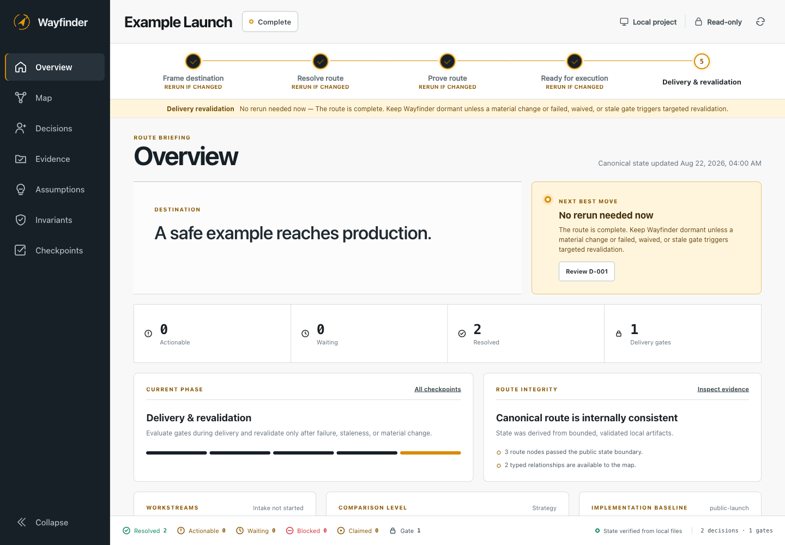
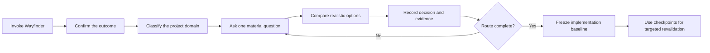

# Wayfinder

> Turn an ambiguous project into a decision-complete route—and keep that route visible while the work changes.

[](https://github.com/Mohammed-Moniem/wayfinder/actions/workflows/validate.yml)
[](https://github.com/Mohammed-Moniem/wayfinder/releases/latest)
[](LICENSE)
[](https://www.python.org/)

Wayfinder is an explicit planning skill for ChatGPT desktop, Codex, and Claude Code. It asks one meaningful question at a time, identifies the kind of project you are planning, compares realistic routes in plain language, records your decisions, and opens a private local dashboard for the resulting map.

It works for software products, construction and operational projects, finance/reporting work, other domains, and hybrid efforts. It does not implement the project or silently make consequential choices for you.



## Why Wayfinder

Most plans become unreliable because important choices stay buried in chat, assumptions look like facts, or the plan does not say when it should be revisited. Wayfinder makes those boundaries explicit:

- **Conversational intake** — one question at a time, with the reason and tradeoffs explained.
- **Domain-aware routes** — software, general/construction, finance/reporting, other, or hybrid.
- **Technology comparisons** — for software, options cover MVP speed, future scale, reliability, efficiency, cost, complexity, lock-in, privacy, team fit, and reversibility.
- **Durable decisions** — every human choice has a stable ID, revision, provenance, evidence link, and append-only history.
- **Visual planning** — seven working dashboard views: Overview, Map, Decisions, Evidence, Assumptions, Invariants, and Checkpoints.
- **Targeted revalidation** — failed gates or changed facts reopen only the affected branch instead of restarting the entire plan.
- **Implementation handoff** — an exact baseline records which destination, intake revision, and decisions downstream work must follow.
- **Local-first privacy** — no account, cloud service, telemetry, runtime package install, or remote dashboard request.

## How it works



The route progresses through five phases:

1. **Frame destination** — define success, constraints, scope, and authority.
2. **Resolve route** — formulate and settle destination-blocking decisions.
3. **Prove route** — validate material assumptions and define delivery gates.
4. **Ready for execution** — verify consistency and freeze the handoff baseline.
5. **Delivery and revalidation** — rerun only after material change, stale evidence, or a failed/waived gate.

## Invocation

Wayfinder is explicit-only. It never activates merely because a request looks complicated.

| Host | Standalone skill | Plugin |
| --- | --- | --- |
| ChatGPT desktop | `@wayfinder` | `@wayfinder` |
| Codex app or CLI | `$wayfinder` | `$wayfinder` |
| Codex IDE extension | `$wayfinder` | Use the standalone skill; plugin installs are not listed in the current support matrix |
| Claude Code | `/wayfinder` | `/wayfinder:wayfinder` |

## Install

Wayfinder requires **Python 3.11 or newer** and has no third-party runtime dependencies.

Download the host-specific ZIP and `SHA256SUMS.txt` from the [latest release](https://github.com/Mohammed-Moniem/wayfinder/releases/latest), verify the checksum, then install the matching artifact.

### ChatGPT desktop or Codex standalone skill

```bash
mkdir -p "$HOME/.agents/skills"
unzip wayfinder-openai-skill-0.2.0.zip -d "$HOME/.agents/skills"
```

For repository-scoped Codex use, extract into `<project>/.agents/skills` instead.

### Claude Code standalone skill

```bash
mkdir -p "$HOME/.claude/skills"
unzip wayfinder-claude-skill-0.2.0.zip -d "$HOME/.claude/skills"
```

For repository-scoped Claude use, extract into `<project>/.claude/skills` instead.

### Codex plugin

Extract the OpenAI plugin ZIP to a stable absolute path, then add its bundled local marketplace:

```bash
unzip wayfinder-openai-plugin-0.2.0.zip -d /absolute/path/to/wayfinder-openai-plugin-0.2.0
codex plugin marketplace add /absolute/path/to/wayfinder-openai-plugin-0.2.0
codex plugin add wayfinder@wayfinder-local
```

### Claude Code plugin

Claude Code 2.1.128 or newer can load the ZIP directly:

```bash
claude --plugin-dir ./wayfinder-claude-plugin-0.2.0.zip
```

See the [complete installation guide](docs/INSTALLATION.md) and [portable package contract](docs/PORTABLE-WAYFINDER.md) for host-specific behavior and source builds.

## The local dashboard

After Wayfinder has enough truthful state to render, the skill starts its installed loopback dashboard and gives you the temporary URL. The dashboard:

- binds only to `127.0.0.1` on a fresh port;
- is read-only by default;
- enables only narrow, revision-checked intake answers in interactive mode;
- uses capability, origin, CSRF, method, content-type, size, schema, and optimistic-concurrency checks;
- writes no dashboard application files into your project;
- loads no remote scripts, fonts, analytics, or APIs.

Human-readable planning state lives under the selected project's `.codex/wayfinder/` directory. Wayfinder never commits or pushes that state; whether a team deliberately versions planning artifacts remains the project owner's choice.

## Build from source

```bash
git clone https://github.com/Mohammed-Moniem/wayfinder.git
cd wayfinder

python3 scripts/validate_repo.py
python3 -m unittest discover -s tests -v
python3 scripts/scan_secrets.py --all
python3 scripts/package_wayfinder.py build --output-dir build/wayfinder
python3 scripts/package_wayfinder.py verify build/wayfinder/*.zip
```

The packager produces four deterministic archives from one canonical authored source:

- `wayfinder-openai-skill-<version>.zip`
- `wayfinder-claude-skill-<version>.zip`
- `wayfinder-openai-plugin-<version>.zip`
- `wayfinder-claude-plugin-<version>.zip`

Claude's explicit-only frontmatter is generated at package time. It is not maintained as a second source copy.

## Safety and privacy

Wayfinder treats maps, evidence, tracker content, dashboard payloads, and research bodies as untrusted data. Generated artifacts never expand authority to deploy, spend, delete, contact people, publish, or mutate external systems.

Packaging rejects private state, credentials, key material, secret-like content, symlinks, ambiguous binaries, oversized files, unsafe archive paths, duplicate JSON keys, and non-deterministic ZIP metadata. Error paths are designed not to reflect attacker-controlled secrets.

See [SECURITY.md](SECURITY.md) for private vulnerability reporting.

## Repository map

```text
skills/wayfinder/              Canonical skill, runtime, references, and dashboard
scripts/package_wayfinder.py   Deterministic four-format packager and verifier
scripts/validate_repo.py       Standalone repository contract validator
scripts/scan_secrets.py        Worktree, index, and Git-history secret scanner
tests/                         State, intake, dashboard, security, and packaging tests
docs/                          Architecture and installation details
```

## Contributing

Contributions are welcome. Start with [CONTRIBUTING.md](CONTRIBUTING.md), preserve the single canonical source and explicit human-choice boundary, and include behavioral tests for material changes.

Wayfinder is available under the [MIT License](LICENSE). See [NOTICE.md](NOTICE.md) for inspiration and attribution.
