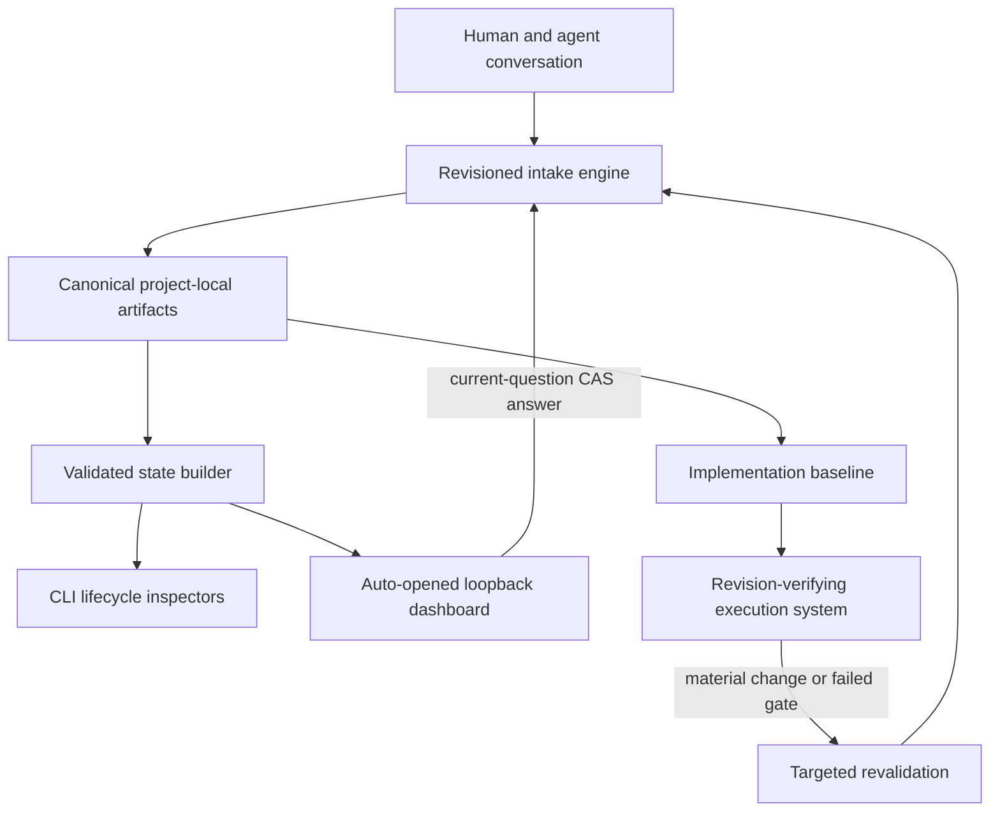

# Architecture

Wayfinder separates conversation, canonical planning state, derived views, and the local dashboard so that no single UI or chat transcript becomes the source of truth.



## Canonical source and packages

`skills/wayfinder/` is the only authored skill tree. `scripts/package_wayfinder.py` packages it as OpenAI and Claude standalone skills and plugins. Claude-only explicit invocation metadata is derived deterministically during packaging.

## Project-local state

Wayfinder stores one active pointer and one directory per planning effort beneath `.codex/wayfinder/` in the explicitly selected project:

```text
.codex/wayfinder/
├── ACTIVE
└── efforts/<slug>/
    ├── MAP.md
    ├── EFFORT.json
    ├── INTAKE.json
    ├── ASSUMPTIONS.md
    ├── INVARIANTS.md
    ├── EXIT.md
    ├── decisions/D-NNN.md
    ├── evidence/E-NNN.md
    └── gates/G-NNN.md
```

Markdown is the human-readable record. `EFFORT.json` is the bounded lifecycle and index manifest. `INTAKE.json` is the revisioned question, answer, comparison, and receipt state. Derived dashboard counts, route edges, health, phases, and exit readiness are rebuilt from validated artifacts.

## Intake and authority

The intake engine uses compare-and-swap revisions and asks one material question at a time. Domain classification is advisory until the human confirms it. Comparisons may recommend an option when their required facts are grounded, but only a human answer records a choice.

Every decision separates:

- autonomy (`AFK`, `HITL`, or `HYBRID`);
- responsible party;
- decision authority;
- next actor;
- destination-blocking status;
- evidence and revalidation triggers.

Planning artifacts are data, not authorization. They cannot grant permission to implement, publish, deploy, spend, delete, contact people, or mutate external systems.

## Lifecycle

The manifest defines five ordered phases and checkpoints: frame destination, resolve route, prove route, ready for execution, and delivery/revalidation. Routine delivery leaves the completed route dormant. A material change, stale premise, failed/waived gate, or new consequential decision reopens only linked branches.

The completion handoff binds the effort ID, manifest digest, destination revision, intake revision, and applicable decision revisions. Downstream work must resolve the active effort, read the manifest, intake, listed Decision artifacts, and current EXIT receipt, and verify those exact bindings before implementation. It can therefore detect drift instead of silently following an outdated chat message or dashboard view.

## Dashboard boundary

The dashboard is dependency-free static HTML, CSS, SVG, and JavaScript served by the installed Python runtime on `127.0.0.1` with a fresh port. The guided skill launches it in a persistent process with an explicit `--open-browser` flag after initial analysis creates truthful state. The stdlib browser request is fail-soft; the capability URL remains available when no browser can open.

Read-only mode exposes validated derived state. Interactive mode adds only two narrow mutation shapes: answer the exact current text question or select one allowed option. Successful writes update `INTAKE.json` and, for material choices, the canonical Decision, Evidence, and `EFFORT.json` indexes; refreshed dashboard state and its live implementation baseline are rebuilt from exact readback. Writes require a capability path, exact loopback host and origin, CSRF token, POST method, JSON content type, bounded body, exact fields, current revision, and atomic validation/readback.

The browser uses text-safe DOM APIs and native `fetch`. It performs no remote requests and stores no analytics.

## Failure model

Unsafe paths, symlinks, duplicate keys, non-finite JSON, excessive nesting, malformed manifests, conflicting indexes, stale revisions, missing evidence, invalid transitions, and oversized input fail closed. Public errors are bounded and non-reflective. Atomic operations restore exact prior bytes when post-write validation fails.

## Runtime dependencies

Wayfinder requires Python 3.11 or newer and a modern browser. It has no PyPI, npm, database, cloud, telemetry, or account dependency.
