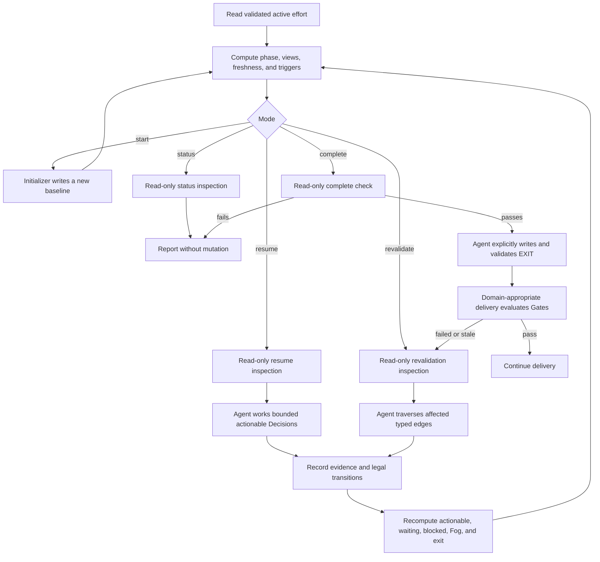

# Wayfinder V3 lifecycle

Use this reference to choose a mode, advance a phase, recommend a checkpoint, perform a legal state transition, or decide whether Wayfinder should run again.

## Mandatory V2 migration gate

Apply this gate before mode selection whenever a matching Wayfinder effort already exists. If `EFFORT.json` is absent or is not valid schema 3, the effort is V2/recovery state. Permit only read-only `status`, `doctor`, `dashboard`, and `migrate --check`; do not run `resume`, `revalidate`, or `complete` mode work and do not mutate V3 artifacts. Run `migrate --check`, follow [recovery.md](recovery.md) while preserving the legacy artifacts, and require both valid schema 3 and a passing `doctor` before crossing the gate. The migration command is a preview and writes nothing. This gate does not prevent `start` for a genuinely new destination with no existing effort.

## Invocation modes

The mode names below describe the Wayfinder skill workflow. `start`/`init` and the narrow revision-checked intake answer commands may initialize or record explicit answers; `resume`, `status`, `revalidate`, and `complete` are read-only inspectors. After an applicable inspector succeeds, the agent may author only the explicit artifact transition described below, then must validate exact readback. An inspector never resolves a human Decision or silently advances lifecycle state.

| Mode | Use when | Agent-authored transition after inspection | Stop condition |
| --- | --- | --- | --- |
| `start` | No effort exists for the destination. | Initialize a new effort and activate `p1-frame`. | Baseline artifacts exist, or initialization fails without replacing existing state. |
| `resume` | A valid schema-3 matching effort is incomplete or already revalidating. | The CLI reports the frontier; the agent then claims/works actionable Decisions, adds evidence, and advances checkpoints through legal artifact transitions. | A bounded frontier slice is resolved, a human/external input is needed, or the exit contract is ready to evaluate. |
| `status` | The user wants orientation or no material trigger is known. | None. It may compute diagnostics and a dashboard payload in memory. | Report phase, counts, next actor, recommended checkpoint, and exact health issues. |
| `revalidate` | A recorded trigger could invalidate a completed route. | The CLI identifies affected nodes; the agent then records still-valid outcomes or legally reopens only Decisions whose rationale no longer holds. | Every affected dependent is marked still valid with evidence or legally reopened. |
| `complete` | The route appears ready for its domain-appropriate execution handoff. | The CLI performs a read-only exit check; only after it passes may the agent explicitly write the completion receipt and advance to `p4-ready`. | Pass readiness then validate the explicit `EXIT.md` transition, or fail with exact blockers and no false completion. |

Invocation is explicit-only at the skill level. Once invoked, mode selection may use validated local state; it does not grant authority for deployment, publication, spending, deletion, messaging, or external writes.

## Iteration loop

There is no fixed iteration count. Resume durable state rather than restarting the analysis.

## Five phases and milestones

| Phase | Milestone | Advance when | Recommended Wayfinder checkpoint |
| --- | --- | --- | --- |
| `p1-frame` **Frame destination** | Destination baseline | Observable success conditions, constraints, scope, authority boundaries, and material stakeholders are explicit. | Run at effort start and whenever destination, scope, authority, or a success condition materially changes. |
| `p2-resolve` **Resolve route** | Decision-complete route | Blocking choices are formulated; actionable dependencies are resolved in order; known unknowns are not mislabeled as Fog. | Resume when a route choice opens, a human decision is due, or a prerequisite settles and unlocks the frontier. |
| `p3-prove` **Prove route** | Evidence-sufficient route | Feasibility claims and material assumptions have fresh evidence; delivery Gates are defined but not executed. | Resume before committing to an expensive, irreversible, safety-critical, or externally constrained route, and when evidence freshness expires. |
| `p4-ready` **Ready for execution** | Completion handoff | The exit contract passes and `EXIT.md` captures the accepted route and execution baseline. | Run `complete` immediately before the execution handoff. Revalidate if the execution plan exposes a missing major choice or contradicts the receipt. |
| `p5-delivery` **Delivery & revalidation** | Delivery milestone | Domain-appropriate delivery checks evaluate the defined Gates after handoff. | Run `revalidate` when a Gate fails or becomes stale, a material external dependency changes, or delivery disproves a route premise. |

Phase progress is not permission to perform delivery work. Phase 5 makes delivery state visible; Wayfinder only re-enters decision work there when a recorded trigger fires.

## When to run Wayfinder again

Recommend `resume` or `revalidate` at these checkpoints:

- destination, success conditions, scope, constraints, authority, budget class, or major architecture changes;
- a blocking prerequisite settles and exposes a new actionable Decision;
- a human or external party provides the input a waiting branch needed;
- a high/critical assumption is refuted, accepted as risk, or becomes stale;
- the subject revision changes beyond the evidence's declared validity;
- immediately before the domain-appropriate execution handoff;
- the execution plan reveals a choice that materially changes behavior, architecture, operations, controls, feasibility, authority, or an irreversible commitment;
- a delivery Gate fails, is waived, or becomes stale;
- delivery evidence contradicts a resolved Decision;
- after a long pause when recorded freshness conditions require review.

Prefer `status`, not another planning iteration, when the user only wants current orientation.

Do **not** rerun Wayfinder merely because:

- another ordinary delivery session starts;
- implementation is following the resolved route;
- a routine test or Gate passes as expected;
- a small bug, copy change, local refactor, or ticket-level choice does not affect the route;
- progress fields or evidence links need a clerical update;
- time passed but no declared freshness or revalidation condition fired.

Route those cases to the relevant delivery or maintenance workflow.

## Decision relevance test

Create or reopen a Decision only if its answer could materially change at least one of:

- the observable destination or feasibility;
- a major architecture, integration, operational, control, supplier, sequencing, or reporting boundary;
- a human authority, legal, safety, privacy, or financial commitment;
- an expensive or difficult-to-reverse path;
- the ability to create a decision-complete execution handoff.

Otherwise defer the choice to the domain's execution plan or bounded delivery work. Wayfinder seeks the minimum decision-complete route, not exhaustive certainty.

## Targeted revalidation

1. Record the trigger, subject revision, actor, timestamp, and evidence.
2. Start from the failed/stale Gate, changed evidence, assumption, constraint, or Decision.
3. Traverse only `revalidates` edges and downstream `requires` dependents.
4. For each affected resolved Decision, record one outcome: `STILL-VALID` with evidence, `REOPENED`, or `SUPERSEDED`.
5. Recompute the affected frontier and exit contract.
6. If no Decision reopens, preserve the completion receipt and report the inspection. If any blocking Decision reopens, mark the receipt stale and return only that branch to active planning.

Never reopen every Decision by default. Never silently edit the old rationale into the new one.

## Human checkpoint contract

For a HITL or HYBRID Decision, present:

- the exact decision authority and exact question;
- current evidence and its freshness;
- viable options and recommendation;
- material consequences, including the consequence of waiting;
- what the answer unlocks;
- the requested receipt or decision wording.

The human answer must be explicit. Silence, prior unrelated approval, a tracker label, or agent-authored text is not authorization or accepted risk.
